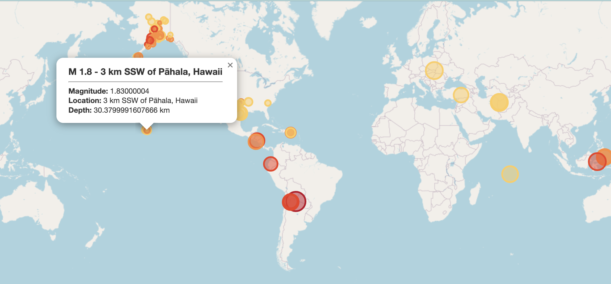
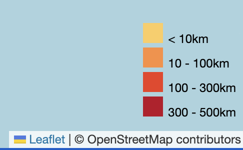
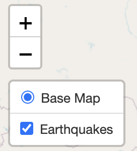
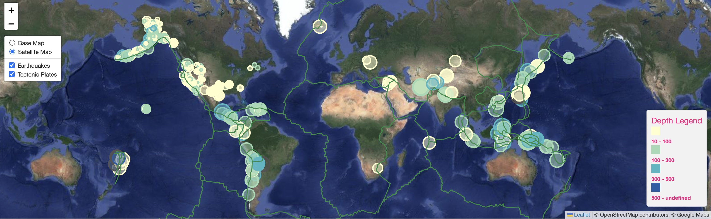

# leaflet-challenge
Module 15 Challenge for UM Bootcamp

## Part 1: Create the Earthquake Visualization
In Part 1: I got the data from the USGS GeoJSON Feed (http://earthquake.usgs.gov/earthquakes.feed/v1.0/geojson.php) and pulled it into my JavaScript file for visualization.

I used Leaflet to create a map that plotted all of the earthquake dataset from the "All Day" data based on their longitude and latitude.  The markers were st up to reflect the magnitude of the earthquake by their size and the depth of the earthquake.  Earthquakes with with greater depths are displayed in a darker shade of red.  There are alos popups that provide the Earthquake Name, Magnitude, Location and Depth of the earthquake when clicked on.

I created a legend for the data as well.

I also created the layering component.

The js file includes the TileLayer, connects to the geojson API using D3, markers correspond to earthquake magnitude on the map.

The data points scale with magnitude level and colors change with depth level and the data points color change with depth level.  Each marker has a popup with magnitude, location and depth and the data points load in the correct locations.

## Part 2: Gather and Plot More Data
In Part 2: I got the data on tectonic plates from https://github.com/fraxen/tectonicplates.  With this data, I plotted the tectonic plates in addition to the earthquake and used a different base map using satellite data and google maps.  Each dataset has a separte overlay and layer controls are also on the map.

After completing both part 1 and 2, I spent some time working on updating the shading of the markers, the fill opacity and the legend colors.

## Credits
Thank you to tutor, Limei Hou, who helped me with figuring out how to order the layering and get the different objects to display and able to check on and off.  She was extremely patient and helpful.  

Thank you to Hunter Hollis, instructor, and TA's Randy and Sam.